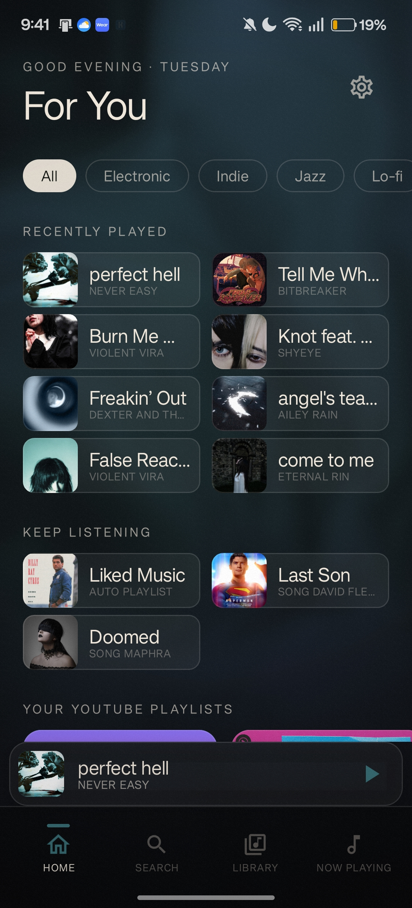
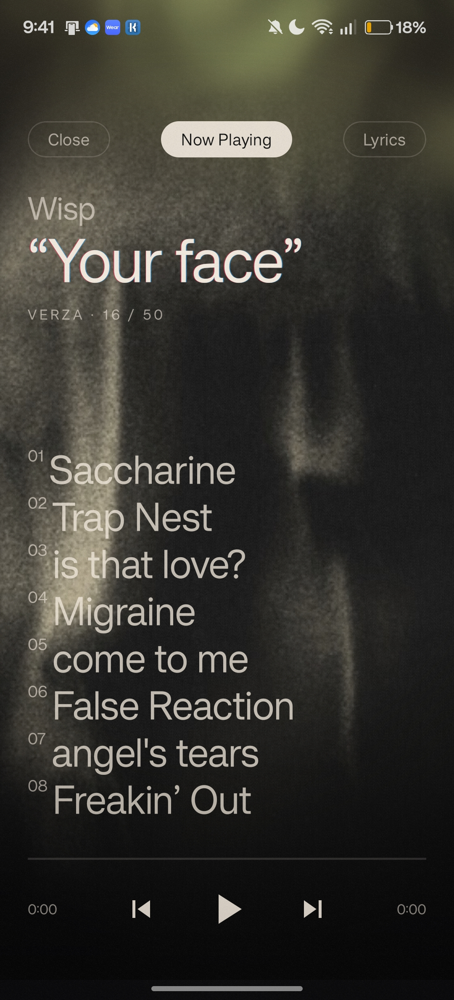

<div align="center">

# Verza

### A YouTube Music client for Android, with an editorial soul.

*The full YouTube Music catalogue — no ads, real album art, offline downloads, and synced lyrics — wrapped in a living, sound-reactive background and **Sleeve**, a cover-driven editorial appearance. Built from scratch in Kotlin + Jetpack Compose.*

<br/>

[](https://kotlinlang.org)
[](https://developer.android.com)
[](https://developer.android.com/jetpack/compose)
[](https://m3.material.io/)
[](LICENSE)

<br/>

&nbsp;&nbsp;

<sub><i>The <b>Sleeve</b> appearance — every surface is sampled from the cover art and floats over the live reactive glow.</i></sub>

</div>

---

## What is Verza?

Verza streams the entire YouTube Music catalogue without ads or a subscription, using [NewPipeExtractor](https://github.com/TeamNewPipe/NewPipeExtractor) for stream resolution and the InnerTube API for browse, search and your personal library. Sign in to bring your home feed, playlists, followed artists and Liked Songs along — or use it fully anonymously.

What sets it apart is the **design**: a GPU-shaded glow that drifts behind the app and takes on each song's colours, and **Sleeve** — an opt-in editorial mode that recolours the whole interface from the current cover art, sets it in a literary serif, and turns Now Playing into a poster.

---

## At a glance

<table>
<tr>
<td width="33%" valign="top">

### 🎧 Music
Full YouTube Music catalogue · No ads · Offline downloads · Song radio · Background playback · Lock-screen controls · Sleep timer

</td>
<td width="33%" valign="top">

### 🌌 Living background
A GPU-shaded **glow** that drifts behind the app, takes on each song's **cover colours**, and can **pulse with the music**

</td>
<td width="33%" valign="top">

### ✒️ Sleeve
A **cover-driven editorial mode** — serif type, film grain, glass chrome, and a poster Now Playing that melts into the glow

</td>
</tr>
<tr>
<td valign="top">

### 🎨 Identity
**Material You** by default · nine curated palettes incl. the **Atelier** pair · Cormorant Garamond / Newsreader display type

</td>
<td valign="top">

### 📊 Your Sound
Top tracks & artists by **real listened time**, totals, and a day streak — from a local play-event log

</td>
<td valign="top">

### 🖼️ Real album art
Songs throughout the app pull the **actual cover** from iTunes Search — no more random music-video frames

</td>
</tr>
</table>

---

## Screenshots

**Sleeve** — the cover-driven editorial appearance

<div align="center">
<table>
<tr>
<td align="center">

<br/>
<sub><b>Home</b> — mono dateline masthead, Newsreader titles, cover-tinted glass cards, film grain over the live glow</sub>
</td>
<td align="center">

<br/>
<sub><b>Now Playing</b> — a full-bleed poster whose cover dissolves into the glow, with the queue framed on the current song</sub>
</td>
</tr>
</table>
</div>

**Default** — Material You, with the album-coloured glow

<div align="center">
<table>
<tr>
<td align="center">

<br/>
<sub><b>Home</b> — personal "For You" feed, mixed section sizes, Material You accent, soft glow behind</sub>
</td>
<td align="center">

<br/>
<sub><b>Now Playing</b> — real album art with the glow picking up the cover's colour</sub>
</td>
</tr>
</table>
</div>

---

## Install

<div align="center">

[](https://github.com/SambuddhaRoy/Verza/releases/latest)

</div>

1. Download the latest **`Verza-vX.Y.Z.apk`** from the [Releases](https://github.com/SambuddhaRoy/Verza/releases) page on your Android phone.
2. Open the file. Android will ask whether your browser may install apps — tap **Settings → Allow from this source**, then go back.
3. Tap the APK again and choose **Install**.
4. A **"Play Protect" warning** appears for any app not from the Play Store — tap **Install anyway** (sometimes under **More details**).
5. Launch Verza from your app drawer. A short first-run setup lets you choose sign-in, theme, appearance and glow.

> **Requirements:** Android 8.0 Oreo (API 26)+. ~10 MB storage. The fluid shader glow uses the GPU on Android 13+; older devices get a lighter gradient glow automatically.

<details>
<summary><b>Why does Android show a "Play Protect" warning?</b></summary>

<br/>

**Because Verza isn't on the Google Play Store — that's the only signal Play Protect can use.** It is **not** a sign of malware.

- *Play Protect* scans every app and warns about anything it can't match to a Play Store record — the same prompt every sideloaded app gets.
- Verza can't be on Play because it's an unofficial YouTube Music client built on public YouTube endpoints, which violates Play's developer policies regardless of code quality — the same reason NewPipe, OuterTune and InnerTune live off-Play.
- **Every line is open and inspectable in this repo.** No obfuscation, no closed blob, no telemetry, no ads.
- After you install once, Android remembers the signing certificate and future updates from the same signer prompt much less, then not at all.

To silence it entirely on a phone you trust Verza on: **Settings → Security → Google Play Protect → ⚙ → Scan apps with Play Protect**. Most people just tap *Install anyway* the one time.

</details>

---

## Features

### Playback
- **Full YouTube Music catalogue** via [NewPipeExtractor](https://github.com/TeamNewPipe/NewPipeExtractor) — handles signature deciphering and the `n`-parameter rolling cipher, so streams play on a clean install with no auth.
- **Resilient stream resolver** — tries progressive HTTP audio → DASH stream URLs → a video-with-audio fallback → the page-level DASH manifest, so playback survives YouTube's periodic format changes.
- **Account sign-in (optional)** — your personalised home, saved playlists, followed artists, and server-side Liked Songs, with likes pushed back to your account.
- **Offline downloads** to app-private storage; the resolver prefers local files, so downloaded tracks play with no network.
- **Song radio**, **sleep timer** (15/30/45/60 min or end-of-track, with a soft fade-out and live countdown), **skip silence**, an **audio-quality** picker, and **queue persistence** across cold starts.
- Foreground **Media3** service with lock-screen / notification controls.

### The living glow
- A flowing, domain-warped **fluid field** rendered with a real **AGSL `RuntimeShader`** on Android 13+, with a multi-radial-gradient fallback on older devices.
- **Album-art adaptive colours** — a vibrant palette extracted from the current cover (AndroidX Palette) tints the glow.
- **Sound reactivity (optional)** — an FFT visualizer drives the glow's motion and brightness with the music's bass / mid / treble.
- Colour presets, three intensity stops, and a **de-monochrome** colour derivation that keeps even Material You's palette lively.

### Sleeve — the editorial appearance
An opt-in, **cover-driven** mode (Settings → Appearance) inspired by record-label landing pages. Every surface — background, cards, chrome, type — recolours from the **current cover art** and floats over the live glow.

- **Typography** — **Newsreader** serif at a light regular weight with tight tracking for all titles; **IBM Plex Mono** for wide-tracked eyebrows, indices and timecodes.
- **Poster Now Playing** — the full-bleed cover **dissolves into the reactive glow at its edges** (no frame, no seam). The **queue is contextual**: the current song is framed second from the top, set large and bold, and switching songs **animates the type and scroll**. Like · Radio · Lyrics · Download all live on the poster.
- **Texture** — film grain, an edge vignette, chromatic-aberration headlines, mono superscript numerals, and moody cover-colour backdrops give it a printed, photographic feel.
- **Carried app-wide** — a mono dateline masthead on Home, full-bleed Album and moody Playlist headers, **translucent "glass" nav, cards and mini-player**, and editorial track listings throughout.
- **"Adaptive · cover"** — a standalone theme that brings the same cover-sampled colour scheme to the standard (non-Sleeve) UI.

### Themes & motion
- **Material You (Dynamic)** is the default on Android 12+, colouring the app from your wallpaper; older devices fall back to **Atelier Dark**.
- Nine curated palettes: the **Atelier** light/dark editorial pair plus **Bauhaus · Malibu · Concrete · Noir · Ember · Acid · Magenta**.
- **Cormorant Garamond** for display/headlines, **Inter** for body/labels, **IBM Plex Mono** for numerals — hairline rules instead of heavy cards.
- Motion: **Material fade-through** between bottom-bar tabs and a **shared-axis** slide for push/pop (emphasized easing), press-scale feedback, a spring-animated nav, staggered home reveal, breathing album art, and a smoothly interpolated seek bar.
- A cold-launch **boot animation** and the **"Fold"** launcher icon (with an Android-13 themed-icon variant).

### Home, Search & Library
- **Home** — a personal-first feed (*Recently Played*, *Quick Picks*, *Your Daily Discover*, *Keep Listening*, *From Your Liked Songs*, *Your YouTube Playlists*, *Similar to …*) with **mixed section sizes** for rhythm.
- **Search** — filter tabs (**Songs · Albums · Artists · Playlists**), as-you-type autocomplete, and clearable recent-search chips.
- **Library** — **Recently played** + **Liked** (Room-backed, offline), a **Downloaded** tab, a **Playlists** tab (local + saved YT playlists), and a **Followed artists** tab. *Add to playlist* on any track from any row.

### Now Playing & Lyrics
- Full-bleed artwork, scrubbable progress, the **Like · Radio · Lyrics · Queue** action row, and an overflow menu (Share, Copy link, Start radio, Sleep timer, Download / Remove).
- **Synced (LRC) lyrics** from [LRCLIB](https://lrclib.net) with line-by-line auto-scroll, a plain-text fallback, and caching per `(title, artist, duration)`.

### Your Sound (listening stats)
- An editorial insights page from a local **play-event log**: total time listened, tracks played, a **day streak**, and your **top artists & tracks** ranked by *real* engaged listening time (paused gaps excluded).

### Onboarding & Settings
- A six-step **first-run setup**: welcome → optional sign-in → theme → **appearance (Standard or Sleeve)** → glow + **sound reactivity** → done.
- **Settings** — General (start screen), **Appearance** (Sleeve), Playback (resume-on-open, skip silence, album-art motion), Audio quality, Theme, Background glow (enable / colour / intensity / reactivity), Search (save & clear history), and Data (reset listening stats).

---

## Tech stack

| Layer | Tech |
|---|---|
| **Language** | Kotlin 2.0 |
| **UI** | Jetpack Compose · Material 3 · Coil 3 · AGSL `RuntimeShader` |
| **Playback** | Media3 / ExoPlayer · custom `ResolvingDataSource` |
| **Stream extraction** | [NewPipeExtractor](https://github.com/TeamNewPipe/NewPipeExtractor) (Mozilla Rhino for the signature cipher) |
| **Colour & audio FX** | AndroidX Palette (album colours) · `android.media.audiofx.Visualizer` (FFT reactivity) |
| **HTTP** | Ktor for InnerTube · OkHttp shared across the app |
| **DI** | Hilt |
| **Persistence** | Room (history / likes / downloads / local playlists / play events) · DataStore (preferences + queue) |
| **Serialization** | kotlinx.serialization |
| **Async** | Kotlin Coroutines + StateFlow |

---

## Architecture

Verza is a three-module Android project:

```
:app          Compose UI, ViewModels, Hilt graph, navigation, theming,
              glow shader, audio visualizer, listening stats
:innertube    InnerTube API client, parsers (search / home / artist / …),
              and the NewPipe-backed stream resolver
:player       Media3 MediaLibraryService + PlayerConnection
              (MediaController wrapper exposing PlaybackState)
```

Because `:player` can't depend on `:app`, two process-wide singletons bridge the gap: **`AudioSessionRegistry`** exposes the live ExoPlayer audio-session id (for the visualizer), and **`PlayerSettings`** carries playback options like skip-silence the other way.

### Playback flow

```
UI ──playSongs──▶ PlaybackViewModel ──setQueue──▶ MediaController
                                                       │
                                                       ▼
                                          ┌────────────────────────┐
                                          │ MediaLibrarySession     │
                                          │ onAddMediaItems()       │
                                          │ ──rebuilds URI──────▶   │  innertube://<videoId>
                                          └────────────────────────┘
                                                       │
                                                       ▼
                                          ┌────────────────────────┐
                                          │ ExoPlayer + Resolving   │
                                          │ DataSource              │
                                          │ 1. Local cached file?   │ ──▶ play from disk
                                          │ 2. NewPipe resolve      │ ──▶ progressive / DASH /
                                          │    (4-strategy)         │     video / manifest URL
                                          └────────────────────────┘
                                                       │
                                                       ▼
                                              ExoPlayer streams bytes
```

The Room `SongEntity.downloadPath` is queried via a small `DownloadLookup` interface in `:player` (implemented in `:app` to avoid a circular dependency), so the service can fall back to local files **before** hitting the network.

---

## Building

**Requirements:** JDK 17 · Android SDK 35 · a device/emulator on API 26+.

```bash
# Clone
git clone https://github.com/SambuddhaRoy/Verza.git
cd Verza

# Point Gradle at your SDK
echo "sdk.dir=/path/to/Android/Sdk" > local.properties

# Build & install a debug APK
./gradlew assembleDebug
./gradlew installDebug
```

The first build pulls NewPipeExtractor, Media3, Compose, Hilt, Room and Ktor — expect ~5–10 minutes on a fresh machine.

**Signing in (optional):** sign-in only unlocks your personalised home, saved playlists, server-side Liked Songs and followed artists — anonymous use covers search, browse, playback, downloads, lyrics and all local features. The in-app login uses a WebView aimed at Google's standard flow (its user-agent is rewritten to avoid the "browser may not be secure" check); a **Paste cookie** fallback is available if needed.

---

## Privacy

Verza has **no backend, no analytics, no tracking, and no ads** — nothing about your usage is ever sent to the developer. See [**`PRIVACY.md`**](PRIVACY.md) for the full policy. In short:

- **On-device only** — liked songs, playlists, history, stats, queue and downloads stay on your phone. The optional sign-in cookie is **encrypted with a hardware-backed Android Keystore key** and excluded from backups.
- **Minimal, anonymous third-party requests** — YouTube/Google for the catalogue (your cookie *only if you sign in*, *only* to Google); Apple iTunes Search gets a title/artist to fetch real cover art; LRCLIB gets title/artist/duration for lyrics. None carry a user identifier.
- **The microphone permission never records you.** It's requested only if you enable the *Sound reactivity* glow, and is used solely to read a frequency snapshot of the music Verza is already playing (Android's `Visualizer` API) to animate the background. No audio is captured, stored, or transmitted — Android just labels the capability "Microphone" because the API is gated by `RECORD_AUDIO`.

---

## Disclaimer

Verza is an unofficial client. It uses public InnerTube endpoints and NewPipeExtractor — there is no premium-tier bypass. Use at your own risk; behaviour may break if YouTube changes its API or stream-resolution mechanism. This project is for educational and personal use, and is not affiliated with, sponsored by, or endorsed by Google, YouTube, or Apple.

---

## Acknowledgments

- [**NewPipeExtractor**](https://github.com/TeamNewPipe/NewPipeExtractor) — YouTube stream extraction, signature deciphering, and the `n`-parameter rolling cipher.
- [**InnerTune · OuterTune · SimpMusic**](https://github.com/z-huang/InnerTune) — Kotlin YouTube Music clients that pioneered the InnerTube-on-Android approach Verza follows.
- [**LRCLIB**](https://lrclib.net) — free, no-auth synced-lyrics provider.
- [**iTunes Search API**](https://developer.apple.com/library/archive/documentation/AudioVideo/Conceptual/iTuneSearchAPI/) — real album art when YouTube serves a music-video frame.
- [**Material 3**](https://m3.material.io/) — design system and the typography / shape / colour primitives.

---

## License

Released under the **Apache License 2.0**. See [`LICENSE`](LICENSE) for the full text.

---

<div align="center">

### Designed and built by [**Sambuddha Roy**](https://github.com/SambuddhaRoy)

<sub>If Verza made your music a little nicer, leaving a ⭐ on the repo means a lot.</sub>

</div>
