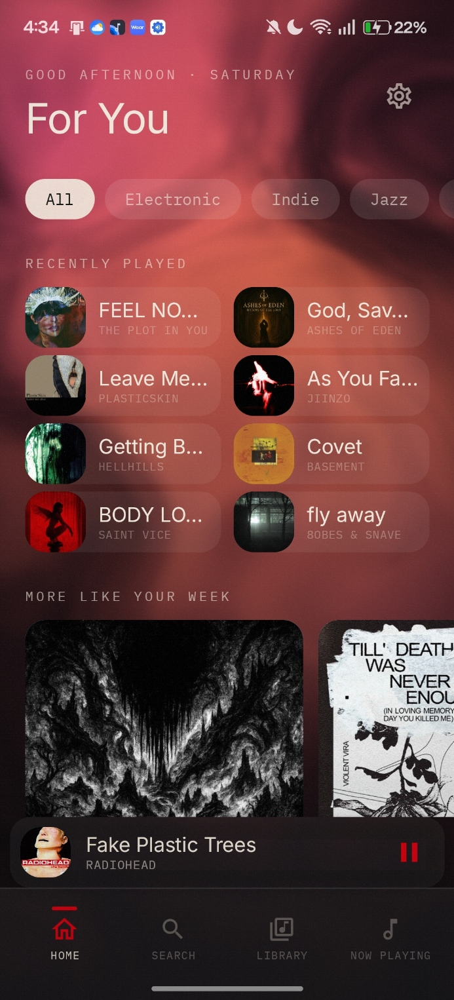
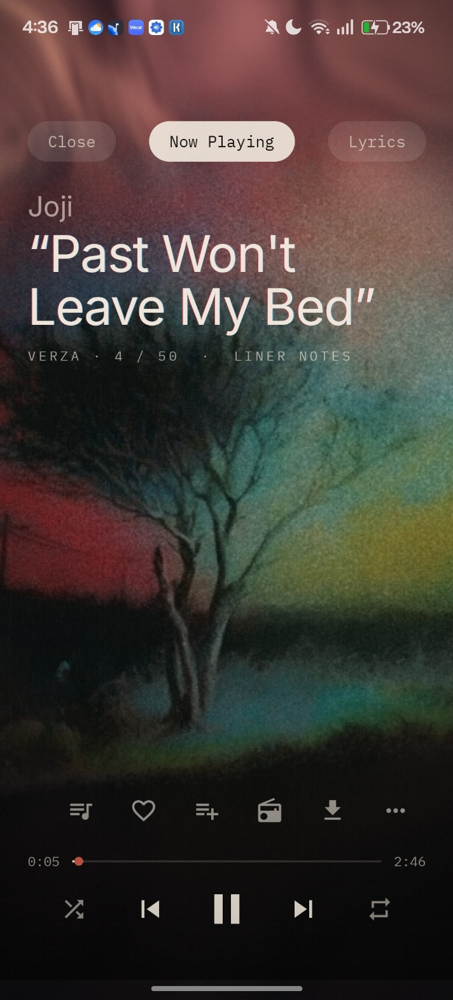
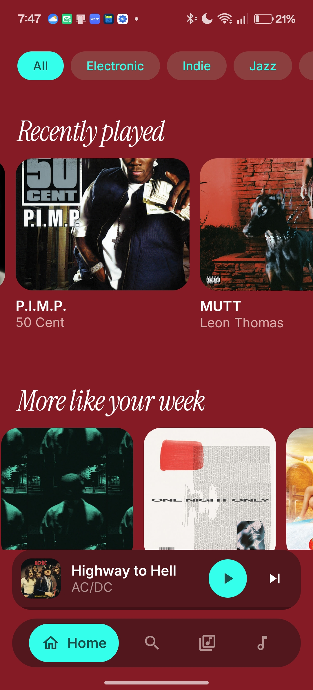
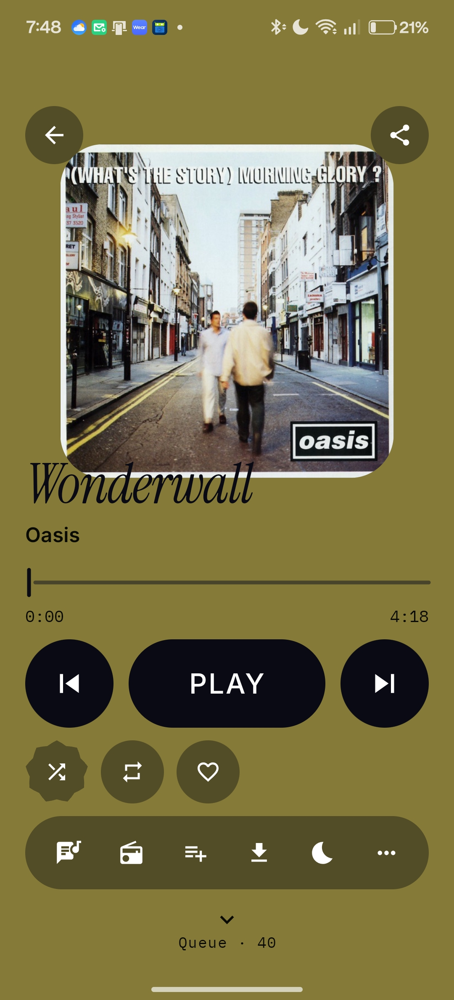

<div align="center">

# Verza

### A YouTube Music client for Android, with an editorial soul.

*The full YouTube Music catalogue — no ads, real album art, offline downloads to your Music folder, and synced lyrics — dressed in **Material 3 Expressive**: a colour scheme pulled from the album art, a cover mask that morphs between tracks, and spring motion throughout. A graphic equalizer, focus sessions, an ambient display, private listening stats and shareable sessions round it out. Built from scratch in Kotlin + Jetpack Compose, with no Google Play Services dependency.*

<br/>

[](https://kotlinlang.org)
[](https://developer.android.com)
[](https://developer.android.com/jetpack/compose)
[](https://m3.material.io/)
[](LICENSE)

<br/>

&nbsp;&nbsp;

<sub><i>Material 3 Expressive — the palette is sampled from the album art, and the cover mask morphs as the track changes.</i></sub>

</div>

---

## What is Verza?

Verza streams the entire YouTube Music catalogue without ads or a subscription, using [NewPipeExtractor](https://github.com/TeamNewPipe/NewPipeExtractor) for stream resolution and the InnerTube API for browse, search and your personal library. Sign in to bring your home feed, playlists, followed artists and Liked Songs along — or use it fully anonymously.

What sets it apart is the **design**: the whole interface takes its colour from the album art, in the Material 3 Expressive language — a saturated canvas, a complementary accent, a cover mask that morphs between tracks, and spring motion throughout. Contrast is enforced by measurement rather than by taste, so a dark or muddy cover never costs you legibility.

---

## At a glance

<table>
<tr>
<td width="33%" valign="top">

### 🎧 Music
Full YouTube Music catalogue · No ads · Offline downloads · Song radio · Background playback · Lock-screen controls · Sleep timer

</td>
<td width="33%" valign="top">

### 🎨 Cover-driven colour
The whole app takes its palette from the **album art** — with every text pair held above **4.5:1** by measured contrast, not by hope

</td>
<td width="33%" valign="top">

### 🌀 Material 3 Expressive
A **morphing cover mask** that changes with each track, a **live spectrum** seek bar, big display type, and spring motion everywhere

</td>
</tr>
<tr>
<td valign="top">

### 🎚️ Sound
A graphic **equalizer**, **bass boost**, and **volume leveling** — bound to the live audio session, loaded only when you use them

</td>
<td valign="top">

### 🧘 Focus & rest
**Focus sessions** that never break the flow · a **wind-down** fade · **gentle start** on resume · an **ambient** lean-back display

</td>
<td valign="top">

### 📊 Your Sound
A private, on-device **Wrapped** — top tracks by real listened time, a *when-you-listen* fingerprint, and your comfort songs

</td>
</tr>
<tr>
<td valign="top">

### 🔗 Listen along
Share your queue as a **`verza://` link** — a friend opens it and picks up the **same set, same spot**. No account, no server

</td>
<td valign="top">

### 💾 Yours to keep
Downloads land in **Music/Verza** as `Artist - Title` files any player opens · **local music**, playlists, and a one-file **export / import**

</td>
<td valign="top">

### 🪶 Free & clean
**No Google Play Services** — bundled OFL fonts, no trackers, no ads. **Updates itself** from GitHub. Ready for **F-Droid / IzzyOnDroid**

</td>
</tr>
</table>

---

## Screenshots

Material 3 Expressive — the cover-driven interface

<div align="center">
<table>
<tr>
<td align="center">

<br/>
<sub><b>Home</b> — mono dateline masthead, big cover-driven titles, cover-tinted glass cards, film grain over the live glow</sub>
</td>
<td align="center">

<br/>
<sub><b>Now Playing</b> — a full-bleed poster whose cover dissolves into the glow; the queue stays collapsed (a tap away) so the artwork leads</sub>
</td>
</tr>
</table>
</div>

**Default** — Material You, with the album-coloured glow

<div align="center">
<table>
<tr>
<td align="center">

<br/>
<sub><b>Home</b> — personal "For You" feed, mixed section sizes, Material You accent, soft glow behind</sub>
</td>
<td align="center">

<br/>
<sub><b>Now Playing</b> — real album art with the glow picking up the cover's colour</sub>
</td>
</tr>
</table>
</div>

---

## Install

<div align="center">

[](https://github.com/SambuddhaRoy/Verza/releases/latest)

</div>

1. Download the latest **`Verza-vX.Y.Z.apk`** from the [Releases](https://github.com/SambuddhaRoy/Verza/releases) page on your Android phone.
2. Open the file. Android will ask whether your browser may install apps — tap **Settings → Allow from this source**, then go back.
3. Tap the APK again and choose **Install**.
4. A **"Play Protect" warning** appears for any app not from the Play Store — tap **Install anyway** (sometimes under **More details**).
5. Launch Verza from your app drawer. A short first-run setup lets you choose sign-in, theme and appearance.

After that first install, Verza checks for its own updates: **Settings → Updates** fetches the newest release from this repo, downloads the APK and hands it to Android's installer. It never installs anything without you tapping through.

> **Requirements:** Android 8.0 Oreo (API 26)+. ~6 MB download (~20 MB installed). The fluid shader glow uses the GPU on Android 13+; older devices get a lighter gradient glow automatically.

<details>
<summary><b>Why does Android show a "Play Protect" warning?</b></summary>

<br/>

**Because Verza isn't on the Google Play Store — that's the only signal Play Protect can use.** It is **not** a sign of malware.

- *Play Protect* scans every app and warns about anything it can't match to a Play Store record — the same prompt every sideloaded app gets.
- Verza can't be on Play because it's an unofficial YouTube Music client built on public YouTube endpoints, which violates Play's developer policies regardless of code quality — the same reason NewPipe, OuterTune and InnerTune live off-Play.
- **Every line is open and inspectable in this repo.** No obfuscation, no closed blob, no telemetry, no ads.
- After you install once, Android remembers the signing certificate and future updates from the same signer prompt much less, then not at all.

To silence it entirely on a phone you trust Verza on: **Settings → Security → Google Play Protect → ⚙ → Scan apps with Play Protect**. Most people just tap *Install anyway* the one time.

</details>

---

## Features

### Playback
- **Full YouTube Music catalogue** via [NewPipeExtractor](https://github.com/TeamNewPipe/NewPipeExtractor) — handles signature deciphering and the `n`-parameter rolling cipher, so streams play on a clean install with no auth.
- **Resilient stream resolver** — tries progressive HTTP audio → DASH stream URLs → a video-with-audio fallback → the page-level DASH manifest, so playback survives YouTube's periodic format changes.
- **Account sign-in (optional)** — your personalised home, saved playlists, followed artists, and server-side Liked Songs, with likes pushed back to your account.
- **Local music** — play audio stored on your device alongside streams, and build playlists from either.
- **Offline downloads** to app-private storage; the resolver prefers local files, so downloaded tracks play with no network.
- **Queue control** — *play next*, *add to queue* (a song, album or whole playlist), **loop** a track or the queue, shuffle, and a persisted queue across cold starts.
- **Song radio**, **gapless** playback, **skip silence**, and an **audio-quality** picker.
- Foreground **Media3** service with lock-screen / notification controls.

### Sound
- A graphic **equalizer** with per-band gain on the device's real band layout, a **bass-boost** slider, and **volume leveling** that lifts quiet tracks toward a steadier perceived loudness.
- Effects bind to the live ExoPlayer audio session and are only loaded once you actually engage one — no audio-framework work at startup for everyone else. *(Settings → Sound → Equalizer)*

### Wind down & focus
- **Sleep timer** — 15/30/45/60 min or end-of-track, with a soft fade-out and a live countdown.
- **Wind-down** — a long, gradual fade across the final minutes instead of a hard cut, for drifting off.
- **Gentle start** — eases the volume up when you resume, a soft "sunrise".
- **Focus / Flow sessions** — a timed (or open-ended) deep-work block that keeps the queue topped up with a radio continuation so silence never breaks your concentration, then fades out with a "you focused for *N* minutes" summary.

### Material 3 Expressive
The whole app is dressed in Material 3 Expressive, driven by the album art.

- **Two-tone, cover-derived** — a saturated container colour and a **complementary accent** taken 180° opposite it on the wheel, so controls and labels read as a different colour rather than a shade of the background.
- **Contrast is measured, not assumed.** Every text/background pair is searched until it clears **4.5:1**, and a unit test sweeps the entire hue wheel — 483 seeds — asserting it. The album art picks the hues; it gets no vote on whether the result is legible.
- **A morphing cover mask** — the artwork is clipped to a scalloped silhouette defined parametrically, so two shapes can be blended by lerping their radii. Pick one in Settings, or let it **change with each track**, chosen from a hash of the track id so a given song always gets the same shape.
- **A live spectrum seek bar** — the played half is a bar visualiser fed from a sixteen-bin FFT; the rest is a flat line, so progress reads at a glance without a number.
- **Spring motion throughout** — spatial animations overshoot and settle, colour animations are critically damped, following the expressive motion scheme rather than fixed durations.
- **Mixed type** — a high-contrast italic display serif for hero names, IBM Plex Mono for metadata and timecodes, Inter for body. All bundled OFL, no Play Services font provider.
- **Feel the beat** — optional **haptics** that tap along with the bass, reading playback only (never the microphone).

### Themes & motion
- **Material You (Dynamic)** is the default on Android 12+, colouring the app from your wallpaper; older devices fall back to **Atelier Dark**.
- Nine curated palettes: the **Atelier** light/dark editorial pair plus **Bauhaus · Malibu · Concrete · Noir · Ember · Acid · Magenta**.
- **Inter** sets all text — display, headline, title, body and label; **IBM Plex Mono** for numerals — hairline rules instead of heavy cards.
- Motion: **Material fade-through** between bottom-bar tabs and a **shared-axis** slide for push/pop (emphasized easing), press-scale feedback, a spring-animated nav, staggered home reveal, breathing album art, and a smoothly interpolated seek bar.
- A cold-launch **boot animation** and the **"Fold"** launcher icon (with an Android-13 themed-icon variant).

### Home, Search & Library
- **Home** — a personal-first feed (*Recently Played*, *Quick Picks*, *Your Daily Discover*, *Keep Listening*, *From Your Liked Songs*, *Your YouTube Playlists*, *Similar to …*) with **mixed section sizes** for rhythm, plus **"More like your week"** — recommendations seeded from your most-listened tracks and computed **on your phone**, with no server-side profiling.
- **Long-press** any song, album or playlist on Home for quick actions — play, play next, add to queue, start a radio, or like it.
- **Search** — filter tabs (**Songs · Albums · Artists · Playlists**), as-you-type autocomplete, and clearable recent-search chips.
- **Library** — **Recently played** + **Liked** (Room-backed, offline), a **Downloaded** tab, a **Playlists** tab (local + saved YT playlists), and a **Followed artists** tab. *Add to playlist* on any track from any row.

### Now Playing, Lyrics & extras
- A morphing cover mask, a live spectrum seek bar, and a labelled **PLAY** pill between two round skips. Lyrics · Radio · Add to playlist · Download · Sleep timer sit in a toolbar on screen rather than behind a menu, with a ⋯ **More** sheet for discovery radio, focus, ambient, liner notes and session sharing.
- **Synced (LRC) lyrics** from [LRCLIB](https://lrclib.net) with line-by-line auto-scroll, a plain-text fallback, and caching per `(title, artist, duration)`.
- **Ambient display** — a full-screen, screen-on clock with a slowly drifting cover, for a desk or nightstand. Tap anywhere to exit.
- **Liner notes** — an editorial card about what's playing (album, year, genre, and a few words), assembled on the fly from iTunes Search + Wikipedia.
- **Share cards** — export the Now-Playing poster (or a lyric) as a still **image** *or* a short **video** with a cinematic push-in, via the system share sheet.

### Your Sound — a private, always-on Wrapped
- An editorial insights page from a **local play-event log** — nothing leaves your phone: total time listened, a **day streak**, your **top artists & tracks** by *real* engaged listening time (paused gaps excluded), a **"when you listen"** 24-hour fingerprint ("you're a night owl"), the **comfort songs** you keep coming back to, and your "listening since" date.

### Listen along
- Share your current queue as a compact, gzipped **`verza://session/…` link**; a friend opens it in Verza and picks up the **same set at the same spot**. No account, no server, no personal data — only streamable tracks travel, and an incoming link is validated and **confirmed before it loads**.

### Own your library
- Export everything you've built — likes (with state), playlists, and your full listening history — to **a single JSON file you own**, and merge it back idempotently on any device. The sign-in cookie is never included.

### Onboarding, the tour & Settings
- A **first-run setup**: welcome → optional sign-in → theme → **sound reactivity** → done.
- A **guided feature tour** offered at the end of setup (and re-openable any time from **Settings → Help → Take the tour**): a swipeable walkthrough of every feature that says plainly *where to find it* and how to use it.
- **Settings** — General (start screen), Playback (resume-on-open, skip silence, album-art motion, **gentle start**), Audio quality, **Sound** (equalizer / bass / loudness), Theme, **Now Playing** (cover shape), **Downloads** (folder + format), **Updates**, Search (save & clear history), Data (**export / import** library, reset listening stats), and Help.

### Built to be free
- **No Google Play Services dependency.** Fonts are bundled as OFL files in the app rather than fetched from the proprietary downloadable-fonts provider, so Verza is clean for **F-Droid / IzzyOnDroid**. No analytics, no trackers, no ads — see [Privacy](#privacy).

---

## Tech stack

| Layer | Tech |
|---|---|
| **Language** | Kotlin 2.0 |
| **UI** | Jetpack Compose · Material 3 · Coil 3 · AGSL `RuntimeShader` · bundled OFL fonts (no Play Services) |
| **Playback** | Media3 / ExoPlayer · custom `ResolvingDataSource` · Media3 Transformer (video share export) |
| **Stream extraction** | [NewPipeExtractor](https://github.com/TeamNewPipe/NewPipeExtractor) (Mozilla Rhino for the signature cipher) |
| **Colour & audio FX** | AndroidX Palette (album colours) · `Visualizer` (FFT reactivity + haptics) · `Equalizer` / `BassBoost` / `LoudnessEnhancer` |
| **HTTP** | Ktor for InnerTube · OkHttp shared across the app |
| **DI** | Hilt |
| **Persistence** | Room (history / likes / downloads / local playlists / play events) · DataStore (preferences + queue) |
| **Serialization** | kotlinx.serialization |
| **Async** | Kotlin Coroutines + StateFlow |

---

## Architecture

Verza is a three-module Android project:

```
:app          Compose UI, ViewModels, Hilt graph, navigation, theming,
              glow shader, audio visualizer + haptics, equalizer/effects,
              listening stats, share cards (image + video), shareable sessions
:innertube    InnerTube API client, parsers (search / home / artist / …),
              and the NewPipe-backed stream resolver
:player       Media3 MediaLibraryService + PlayerConnection
              (MediaController wrapper exposing PlaybackState)
```

Because `:player` can't depend on `:app`, two process-wide singletons bridge the gap: **`AudioSessionRegistry`** exposes the live ExoPlayer audio-session id (for the visualizer), and **`PlayerSettings`** carries playback options like skip-silence the other way.

### Playback flow

```
UI ──playSongs──▶ PlaybackViewModel ──setQueue──▶ MediaController
                                                       │
                                                       ▼
                                          ┌────────────────────────┐
                                          │ MediaLibrarySession     │
                                          │ onAddMediaItems()       │
                                          │ ──rebuilds URI──────▶   │  innertube://<videoId>
                                          └────────────────────────┘
                                                       │
                                                       ▼
                                          ┌────────────────────────┐
                                          │ ExoPlayer + Resolving   │
                                          │ DataSource              │
                                          │ 1. Local cached file?   │ ──▶ play from disk
                                          │ 2. NewPipe resolve      │ ──▶ progressive / DASH /
                                          │    (4-strategy)         │     video / manifest URL
                                          └────────────────────────┘
                                                       │
                                                       ▼
                                              ExoPlayer streams bytes
```

The Room `SongEntity.downloadPath` is queried via a small `DownloadLookup` interface in `:player` (implemented in `:app` to avoid a circular dependency), so the service can fall back to local files **before** hitting the network.

---

## Building

**Requirements:** JDK 17 · Android SDK 35 · a device/emulator on API 26+.

```bash
# Clone
git clone https://github.com/SambuddhaRoy/Verza.git
cd Verza

# Point Gradle at your SDK
echo "sdk.dir=/path/to/Android/Sdk" > local.properties

# Build & install a debug APK
./gradlew assembleDebug
./gradlew installDebug
```

The first build pulls NewPipeExtractor, Media3, Compose, Hilt, Room and Ktor — expect ~5–10 minutes on a fresh machine.

**Signing in (optional):** sign-in only unlocks your personalised home, saved playlists, server-side Liked Songs and followed artists — anonymous use covers search, browse, playback, downloads, lyrics and all local features. The in-app login uses a WebView aimed at Google's standard flow (its user-agent is rewritten to avoid the "browser may not be secure" check); a **Paste cookie** fallback is available if needed.

---

## Privacy

Verza has **no backend, no analytics, no tracking, and no ads** — nothing about your usage is ever sent to the developer. See [**`PRIVACY.md`**](PRIVACY.md) for the full policy. In short:

- **On-device only** — liked songs, playlists, history, stats, queue and downloads stay on your phone. Recommendations and Your Sound are computed locally. The optional sign-in cookie is **encrypted with a hardware-backed Android Keystore key** and excluded from both backups and shared session links.
- **Minimal, anonymous third-party requests** — YouTube/Google for the catalogue (your cookie *only if you sign in*, *only* to Google); Apple iTunes Search gets a title/artist to fetch real cover art; LRCLIB gets title/artist/duration for lyrics. None carry a user identifier.
- **The microphone permission never records you.** It's requested only if you enable the *Sound reactivity* glow, and is used solely to read a frequency snapshot of the music Verza is already playing (Android's `Visualizer` API) to animate the background. No audio is captured, stored, or transmitted — Android just labels the capability "Microphone" because the API is gated by `RECORD_AUDIO`.

---

## Disclaimer

Verza is an unofficial client. It uses public InnerTube endpoints and NewPipeExtractor — there is no premium-tier bypass. Use at your own risk; behaviour may break if YouTube changes its API or stream-resolution mechanism. This project is for educational and personal use, and is not affiliated with, sponsored by, or endorsed by Google, YouTube, or Apple.

---

## Acknowledgments

- [**NewPipeExtractor**](https://github.com/TeamNewPipe/NewPipeExtractor) — YouTube stream extraction, signature deciphering, and the `n`-parameter rolling cipher.
- [**InnerTune · OuterTune · SimpMusic**](https://github.com/z-huang/InnerTune) — Kotlin YouTube Music clients that pioneered the InnerTube-on-Android approach Verza follows.
- [**LRCLIB**](https://lrclib.net) — free, no-auth synced-lyrics provider.
- [**iTunes Search API**](https://developer.apple.com/library/archive/documentation/AudioVideo/Conceptual/iTuneSearchAPI/) — real album art when YouTube serves a music-video frame; liner-notes metadata.
- [**Material 3**](https://m3.material.io/) — design system and the typography / shape / colour primitives.
- **Fonts** — Inter and IBM Plex Mono, both under the SIL Open Font License and bundled in-app. See [`FONTS.md`](FONTS.md).

---

## License

Released under the **Apache License 2.0**. See [`LICENSE`](LICENSE) for the full text.

---

<div align="center">

### Designed and built by [**Sambuddha Roy**](https://github.com/SambuddhaRoy)

<sub>If Verza made your music a little nicer, leaving a ⭐ on the repo means a lot.</sub>

</div>
